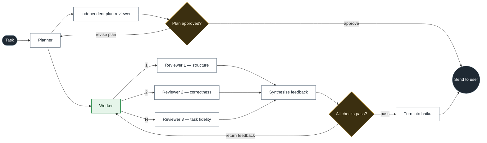

# graph_looper

Draw an agent workflow as a graph. Run it as a real multi-agent loop.

You write the graph once, as YAML — nodes are agents, gates, and transforms;
edges are the routing, including the edges that point *backwards*. The engine
runs it: fanning out to parallel reviewers, waiting on joins, routing on gate
decisions, looping back on failure, and stopping when a visit budget runs out.
Then it hands you the trace and a diagram of the path it actually took.



That graph ships as `reviewer-loop`. Green is a **resident** agent — it keeps its
own conversation across visits, so on a retry the worker remembers the draft it
wrote last time. White is **ephemeral** — fresh context every visit, which is
what you want for reviewers who should not be anchored by their own earlier
verdict.

## Install

```bash
pip install -e .
```

Credentials resolve the way the Anthropic SDK resolves them: `ANTHROPIC_API_KEY`,
`ANTHROPIC_AUTH_TOKEN`, or a profile from `ant auth login`.

## Use it

```bash
graphloop examples                      # what's bundled
graphloop validate reviewer-loop -v     # check a graph, list its loops
graphloop viz reviewer-loop             # Mermaid, to stdout

graphloop run reviewer-loop \
  --input "Write a 200-word explainer on why prediction markets misprice tails." \
  --trace run.json \
  --viz run.md
```

`--trace` writes every event, every node result, and the token count.
`--viz` writes the same diagram with the path taken highlighted and the visit
counts on the nodes — so a worker that went round twice reads `Worker ×2`.

### Run it without spending anything

`--dry-run` swaps in a mock provider, so routing, joins, loops, and budgets all
execute with no model calls. `--mock` scripts specific answers per node, which
is how you test that a loop actually loops:

```bash
cat > mock.json <<'JSON'
{
  "worker": ["draft one", "draft two"],
  "checks_pass": [{"choice": "fail", "reason": "two real defects"},
                  {"choice": "pass", "reason": "all reviewers passed"}]
}
JSON

graphloop run reviewer-loop -i "..." --mock mock.json
```

Each node's script is consumed one call at a time; once it runs out the last
entry repeats, so a loop whose final scripted verdict is `pass` always
terminates.

## Writing a graph

```yaml
name: draft-critique

defaults:
  model: claude-opus-5
  effort: medium
  max_visits: 3          # how many times a gate is asked before it is forced

nodes:
  - id: brief
    type: input

  - id: writer
    type: agent
    mode: resident       # keeps its conversation across visits
    join: any            # fires on whichever edge delivers first
    prompt: |
      Brief: {{ task }}

      Critique of your last draft (blank on the first pass):
      {{ results.critic }}

      Write the next draft. Output the draft only.

  - id: critic
    type: agent          # ephemeral by default — fresh context every visit
    prompt: |
      Draft:
      {{ inputs.writer }}

      Name the three things most worth fixing. If it meets the brief, say
      "Ship it." and nothing else.

  - id: good_enough
    type: gate
    choices: [ship, revise]
    on_exhausted: ship   # forced once the visit budget is spent
    prompt: "{{ inputs.critic }}"

  - id: final
    type: output
    prompt: "{{ results.writer }}"

edges:
  - from: brief
    to: writer
  - from: writer
    to: critic
  - from: critic
    to: good_enough
  - from: good_enough
    to: writer           # the loop
    when: revise
  - from: good_enough
    to: final
    when: ship
```

### Node types

| type        | what it does |
|-------------|--------------|
| `input`     | Entry point. Receives the run's task. |
| `agent`     | An LLM call. `mode: ephemeral` (default) or `resident`. |
| `gate`      | An LLM call constrained to pick one of `choices`; edges route on the pick. |
| `transform` | No model call. `op:` `concat` · `first` · `last` · `template` · `json`. |
| `output`    | Terminal. Its text is the run's result. |

Agent and gate nodes also take `model`, `max_tokens`, `effort`, `system`,
`thinking: false`, and `output_schema` (a JSON schema — the node then returns
parsed structured output, and `label_from: data.<key>` lets a plain agent route
like a gate).

### Joins — the part that makes loops work

A node fires when its incoming edges satisfy its join mode:

- **`join: all`** (default) — waits for a message on *every* incoming edge.
  This is fan-in: the synthesiser waits for all three reviewers.
- **`join: any`** — fires on whichever arrives first. Any node sitting inside a
  loop needs this, because it is fed both by its normal upstream *and* by the
  feedback edge, and only one of those will deliver on a given pass. `all`
  would deadlock there.

Every node ready in the same tick runs concurrently, so three reviewers cost
the wall-clock of the slowest one, not the sum.

### Loops always terminate

Three independent brakes, so a graph cannot spin forever:

- **Gate visit budget** — `max_visits` on a gate (default from
  `defaults.max_visits`). Once spent, the gate stops asking the model and takes
  its `on_exhausted` branch. This is the one that actually shapes behaviour:
  *retry twice, then ship what we have.*
- **`limits.max_node_visits`** (default 25) — a runaway guard on every other
  node. Tripping it fails the run rather than forcing a branch, because it means
  the graph is wrong, not the work.
- **`limits.max_steps`** / **`limits.max_seconds`** — whole-run ceilings.

A run that cannot reach an output stops with a diagnostic naming the node that
stalled and what it was waiting for, instead of hanging.

### Prompt templates

Prompts are templates over `{{ dotted.paths }}`. Single braces are left alone,
so JSON examples in a prompt survive untouched.

| path | what it is |
|------|-----------|
| `{{ task }}` | the run's input |
| `{{ inputs.<node> }}` | text from that upstream node, *for this firing* |
| `{{ input }}` | every incoming message, joined under headings |
| `{{ results.<node> }}` | that node's most recent result, from anywhere in the run |
| `{{ data.<node>.<key> }}` | a structured field from an upstream node |
| `{{ iteration }}` | this node's visit count |
| `{{ vars.<key> }}` | a variable from `--var key=value` |

Unknown paths render empty. That is deliberate: on the first pass through a
loop, `{{ results.synthesize }}` has nothing in it yet, and that is not an error.

Use `inputs.` when a node should react to what just arrived, and `results.` when
it needs the latest of something that arrived on a different pass — which is why
the worker reads `{{ results.planner }}` for the plan and `{{ results.synthesize }}`
for the feedback.

## Generating a graph from a sketch

```bash
graphloop author "a research loop: three searchers in parallel, a synthesiser, \
  and a gate that sends it back for gaps" -o research.yaml

graphloop author --image whiteboard.jpg -o from-sketch.yaml
```

Claude reads the description or the photo, emits a graph, and the result is
validated. If validation fails, the errors are handed back for another attempt —
so what lands on disk is a graph that runs, not a plausible-looking one.

## Using it as a library

```python
from graph_looper import AnthropicProvider, Runner, load_graph

graph = load_graph("graph_looper/graphs/reviewer-loop.yaml")
result = Runner(graph, AnthropicProvider()).run("Write the explainer.")

print(result.output)
print(result.results["synthesize"].text)
for event in result.trace.events:
    print(event.kind, event.node)
```

`Runner.arun` is the async form. Pass `on_event=` for live progress.

## Development

```bash
pip install -e ".[dev]"
pytest
```

The suite runs entirely on the mock provider — no key, no network. The live
provider is covered by tests that assert the exact request shape (thinking mode,
effort, structured-output schema, refusal handling) against a fake client.

## Layout

```
graph_looper/
  spec.py       graph parsing and validation
  runtime.py    the execution engine — scheduling, joins, loops, budgets
  providers.py  Anthropic and mock providers
  template.py   the {{ path }} renderer
  render.py     Mermaid and text output
  author.py     graph generation from a description or an image
  cli.py        the graphloop command
  graphs/       bundled example graphs
```
